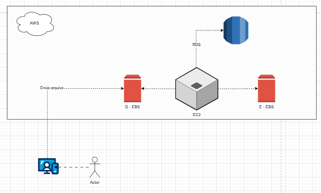

# 🧩 Desafio AWS — EC2, EBS, RDS e AMI

Este projeto faz parte do estudo sobre os principais serviços de **computação e armazenamento da AWS**, explorando o funcionamento de **instâncias EC2**, **volumes EBS**, **banco de dados RDS** e **imagens AMI**.

---

## 🧠 Conceitos abordados

- **EC2 (Elastic Compute Cloud):** serviço de computação em nuvem que permite criar e gerenciar instâncias virtuais.  
- **EBS (Elastic Block Store):** armazenamento persistente usado pelas instâncias EC2 para guardar dados mesmo após o desligamento.  
- **RDS (Relational Database Service):** serviço gerenciado de banco de dados relacional.  
- **AMI (Amazon Machine Image):** imagem que contém as informações necessárias para inicializar uma instância EC2.  
- **Snapshots EBS:** cópias de segurança de volumes EBS que permitem restauração rápida e criação de novas instâncias a partir do estado salvo.

---

## 🧱 Desafio proposto

O desafio consistiu em **criar e visualizar a arquitetura** de uma aplicação simples na AWS, utilizando:

- Uma instância **EC2** conectada a volumes **EBS**.  
- Um **RDS** para armazenamento de dados.  
- Criação e uso de **imagens AMI** e **snapshots EBS**.  
- Representação visual da arquitetura em um **diagrama**.

---

## 📊 Diagrama da arquitetura

O diagrama abaixo representa o fluxo da arquitetura criada no desafio:

### 🔍 Explicação do fluxo

1. O **ator** (usuário) envia um arquivo para o ambiente AWS.  
2. O arquivo é recebido pela instância **EC2**, armazenado em um volume **EBS** (Disco D).  
3. A instância processa os dados e pode armazenar resultados em outro volume **EBS** (Disco E).  
4. Os dados necessários são enviados e consultados no **RDS**.  
5. A arquitetura pode ser replicada facilmente utilizando uma **AMI** ou **snapshot EBS**.

---

## 🚀 Objetivo do desafio

Demonstrar a **importância da visualização arquitetural** para entender o fluxo entre os serviços da AWS e a relação entre **armazenamento, computação e banco de dados**.  
Essa prática ajuda a planejar ambientes escaláveis e seguros na nuvem.

---
